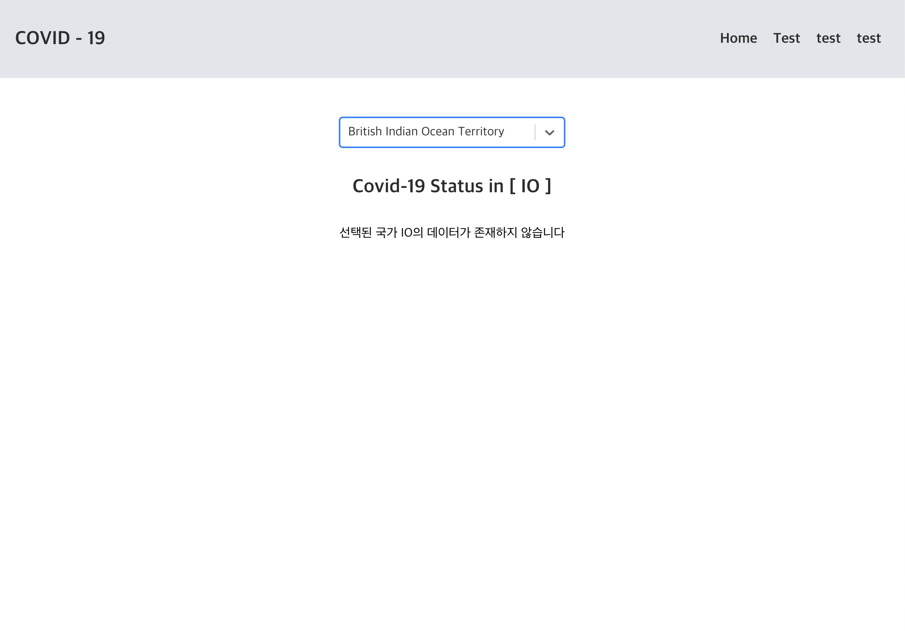
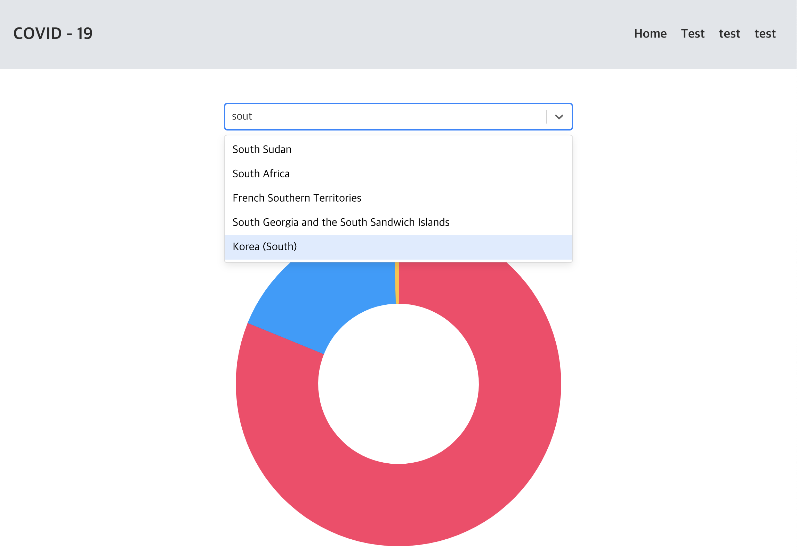
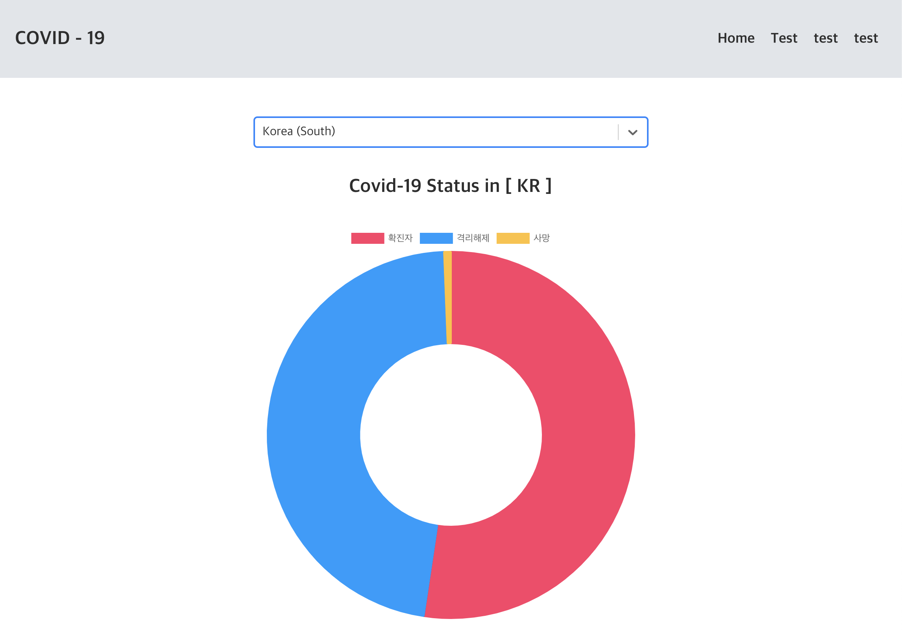

# covid - chart

axios를 이용하여 covid-19 데이터를 가져와 가공하는 연습을 하기 위해 제작한 프로젝트.

### Tech

---

- React.js
- Styled Components
- axios
- chart.js

### Image

---

- 데이터 없는 상태
  
- 나라 검색
  
- 데이터 있을 시 로딩
  
